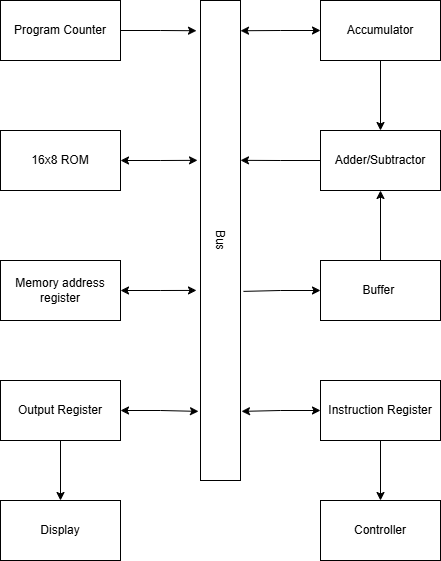

# SAP-1 CPU on Basys 3 FPGA

An implementation of the SAP-1 (Simple-As-Possible, 1st generation) 8-bit educational CPU architecture, built in VHDL and running on a Digilent Basys 3 (Xilinx Artix-7) FPGA board.

SAP-1 is the classic teaching CPU architecture from Albert Malvino's *Digital Computer Electronics*, designed to illustrate the fetch-decode-execute cycle with a minimal instruction set and a single shared internal bus.

## Features

- 8-bit SAP-1 CPU core: Program Counter, MAR, ROM (16x8), Instruction Register, Accumulator, Buffer Register, Adder/Subtractor, and Output Register, all connected via a shared internal bus
- Controller sequencing fetch/execute cycles
- Two clock modes, selected by a switch:
  - **Auto-run**: CPU clocked continuously via a divided-down clock
	  - can change the speed of the auto run clock by going into clock_divider source file and changing `clk_out <= counter(25);` to a smaller number for a faster clock 
  - **Manual step**: CPU advances one clock pulse per button press, for step-by-step debugging
- Live output value shown on a 4-digit seven-segment display, converted from binary to BCD using a double-dabble algorithm 
- Live internal bus value displayed on the onboard LEDs for real-time debugging of any bus-mux state
- Active high synchronous reset/clear

## Architecture

Data flows onto `W_bus` from exactly one source per clock cycle, selected by `bus_sel` from the Controller. 

## Instruction Set

| Opcode (binary) | Mnemonic | Operation                         |
|------------------|----------|-----------------------------------|
| 0000             | LDA addr | Load Accumulator from RAM[addr]   |
| 0001             | ADD addr | Add RAM[addr] to Accumulator      |
| 0010             | SUB addr | Subtract RAM[addr] from Accumulator |
| 1110             | OUT      | Load Accumulator value to Output Register |
| 1111             | HLT      | Halt the clock                    |

## Hardware & Tools

- **Board:** Digilent Basys 3 (Xilinx Artix-7, XC7A35T)
- **Toolchain:** Xilinx Vivado 2025.2.1
- **Language:** VHDL-2008

## Getting Started

1. Clone this repository
2. Open Vivado and create a new project, adding all files under `/src` as design sources and `/constraints/*.xdc` as constraint files.
3. Set the project's source files to **VHDL-2008** (Sources pane → right-click file → Source Node Properties → File Type).
4. Run Synthesis → Implementation → Generate Bitstream.
5. Connect the Basys 3 via USB, open Hardware Manager, and program the device with the generated `.bit` file.

## Usage

- **`mode` switch** (V17) — selects between auto-run clock (low) and manual step clock (high)
- **`btn_step`** (BTNU T18)— advances the CPU by one clock pulse when in manual step mode
- **`reset`** (BTNC U18)— synchronously clears the CPU state
- **Seven-segment display** — shows the current Output Register value in decimal (BCD-converted)
- **LEDs** (L1 down to V13) — show the live value currently on the internal bus (`W_bus`), useful for tracing execution step by step

To load a program, edit the contents of the 16x8 grid signal in `ROM16x8` and re-synthesize.

## Known Limitations / Future Work

- Program memory (ROM) is fixed at synthesis time, no runtime program loading
- sometime if you press the button clock too fast it can cause the bus to be loaded with incorrect values
- code over all is pretty inefficient
- adding the ability to program memory and the program counter during runtime

## Acknowledgments

- SAP-1 architecture as described in *Digital Computer Electronics* by Albert Malvino, Jerald Brown, and Patrick Hess
- Basys 3 constraint file template courtesy of Digilent Inc.
- *The Student's Guide to VHDL* second edition by Peter J. Ashenden 
